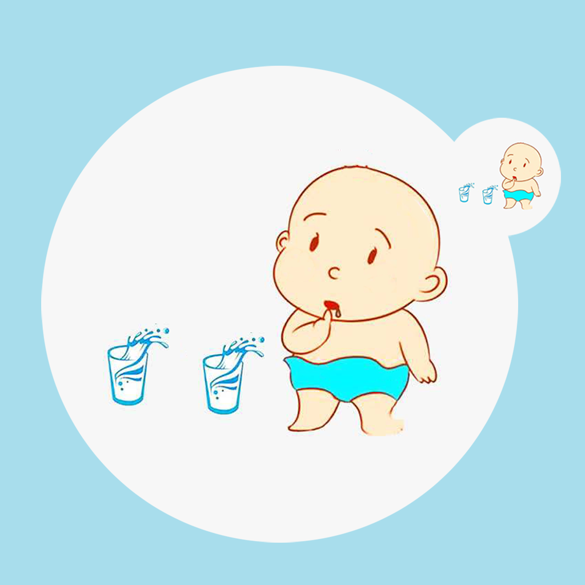

## Welcome to Baby Learns Use Cup Record

Babies often need cups in their daily lives. For example, the baby wants to drink water or milk. The process of your baby learning to use the cup is very important because it relates to the basic skills of learning to live independently. As parents, we should try our best to help and encourage our baby to learn the skill of using cups. We can record the way the baby learns to use the cup, the time and the baby learns the mood and feelings and so on. You can organize this information into a list to better help your baby learn the skill of using cups.

If you have any questions, you can either leave a message or send the questions to our email address.

We will answer them for you in the first time.

### Address: jichungan9498@163.com

Thank you!
